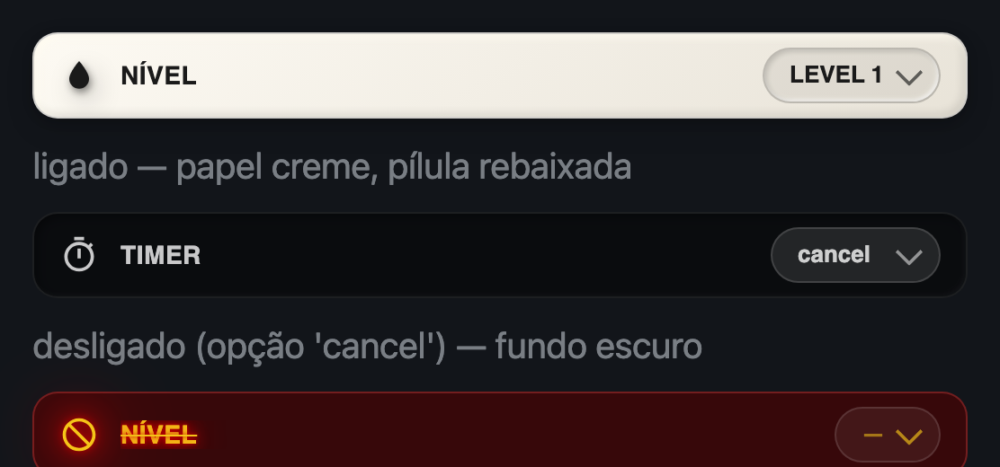
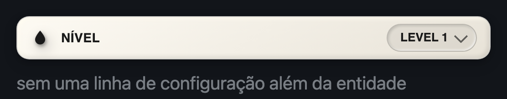
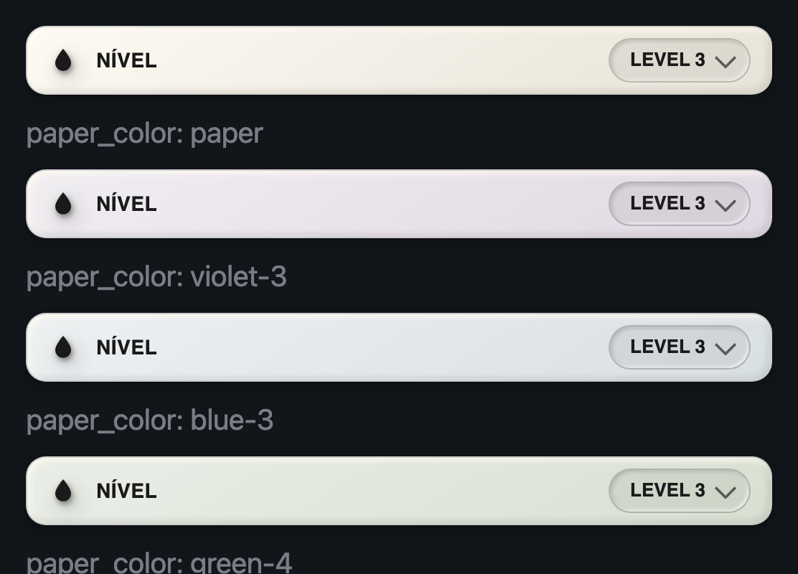
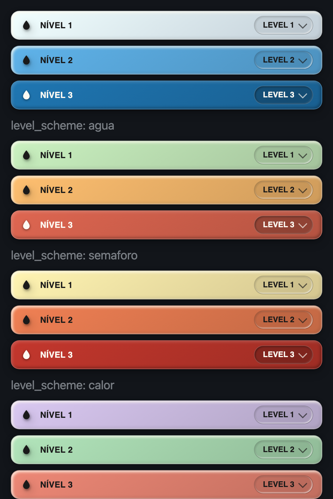
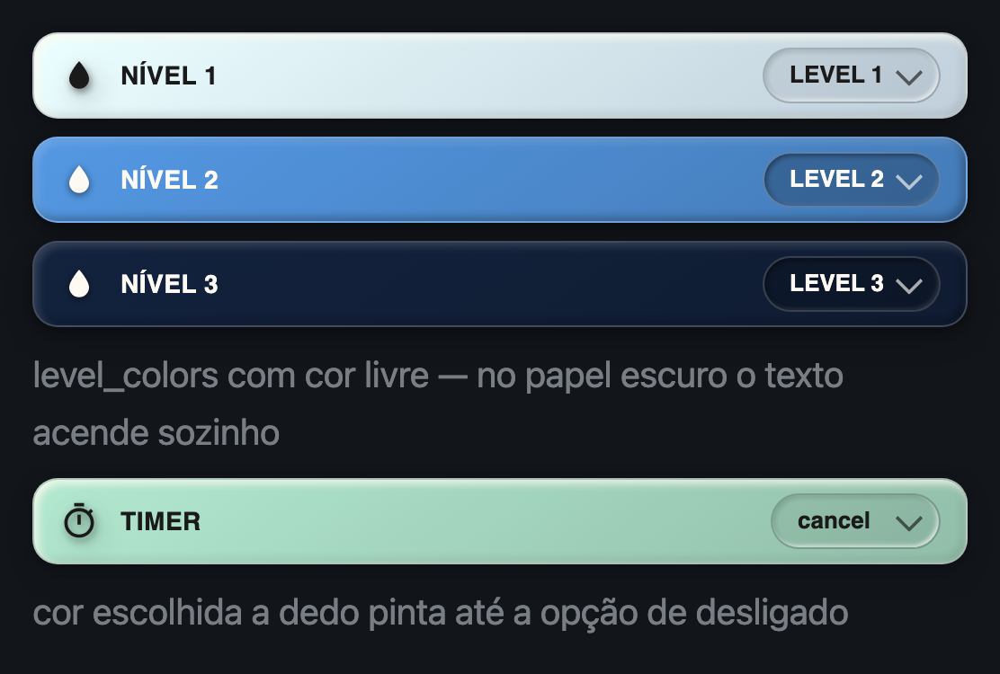
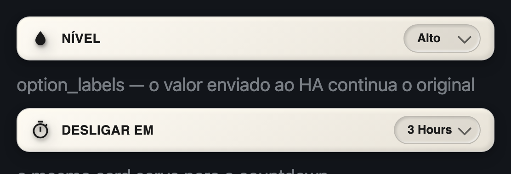
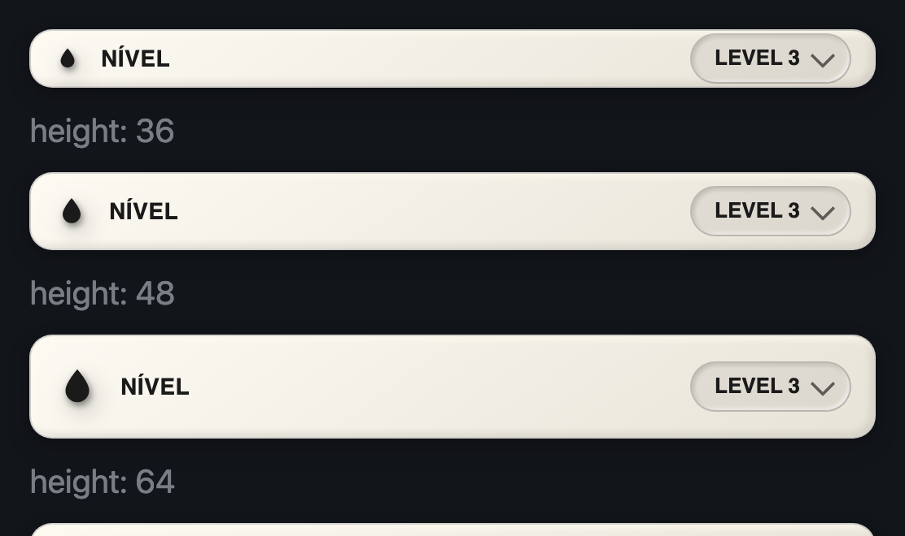

# MW Humidifier Level Card

[](https://hacs.xyz)

Uma linha: **ícone · rótulo · seletor**. Para o nível de névoa do umidificador
— e para qualquer outro `select` dele (countdown, modo, velocidade).



Aponte o dispositivo, escolha a entidade, acabou. O rótulo, o ícone e as
opções o card descobre sozinho.

```yaml
type: custom:mw-humidifier-level-card
entity: select.escritorio_umidificador_escritorio_local_spraying_level
```



Arquivo único, sem build: `dist/mw-humidifier-level-card.js` é fonte e
artefato. JS puro + `<ha-form>`, sem dependências.

## O que ele resolve

O `tile` com a feature `select-options` funciona, mas não conversa com o
papel/neumórfico do resto da parede — e exige `name`, `hide_state`,
`tap_action: none`, `features_position: inline` para chegar perto. Aqui é uma
linha de YAML, com o desenho da família e **os quatro estados**:

| Estado | O que desenha |
|---|---|
| **ativo** | Papel creme (ou a cor escolhida), pílula rebaixada, texto escuro. |
| **desligado** | A opção é `cancel`/`off`/`none` → fundo escuro, texto claro. O seletor **continua utilizável** (é assim que se liga de novo). |
| **sem resposta** | Fundo vinho, 🚫 âmbar com halo vermelho, rótulo riscado, seletor travado. |
| **entidade inexistente** | Cai em *sem resposta* — nunca em erro de render, que derruba a tela inteira. |

## Instalação

### HACS

1. HACS → **⋮** → **Repositórios personalizados**
2. URL: `https://github.com/visaodeempresa/mw-ha-humidifier-level-card` ·
   Categoria: **Dashboard**
3. Instalar **MW Humidifier Level Card** e recarregar a página (⌘⇧R).

### Manual

`dist/mw-humidifier-level-card.js` em `/config/www/` e o recurso
`/local/mw-humidifier-level-card.js` (Módulo JavaScript) em
**Configurações → Painéis → ⋮ → Recursos**.

---

## Exemplos

### 1 · O mínimo

```yaml
type: custom:mw-humidifier-level-card
entity: select.escritorio_umidificador_escritorio_local_spraying_level
```

O rótulo sai do **fim** do `entity_id`: `_spraying_level` → **NÍVEL** com uma
gota, `_countdown` → **TIMER** com um cronômetro, `_speed` → **VELOCIDADE**,
`_mode` → **MODO**. Numa view `sections` o card já nasce ocupando a linha
inteira (`getGridOptions`).

### 2 · Papel por cômodo



```yaml
type: custom:mw-humidifier-level-card
entity: select.suite_umidificador_da_suite_local_spraying_level
paper_color: violet-3     # 7 matizes × 7 tons, a mesma paleta da família
```

### 3 · Uma cor para cada nível



Uma linha e o card passa a mudar de cor conforme o nível escolhido — dá para
ler a parede inteira de longe, sem chegar perto do texto:

```yaml
type: custom:mw-humidifier-level-card
entity: select.suite_umidificador_da_suite_local_spraying_level
level_scheme: agua        # água, verde, maré, semáforo, calor, arco-íris, noite…
```

| `level_scheme` | A rampa |
|---|---|
| `none` *(padrão)* | Cor única — o `paper_color` de sempre. |
| `agua` | Azul claro → azul fundo. |
| `verde` | Broto → mata. |
| `mare` | Verde-água → anil. |
| `semaforo` | Verde → amarelo → vermelho. |
| `calor` | Amarelo → laranja → vermelho. |
| `arco-iris` | Violeta → vermelho, passando pelo meio do arco. |
| `noite` | Anil claro → noite fechada. |
| `nevoa` | Sussurro de papel: creme → azul, na paleta da família. |
| `encardido` | Sussurro de papel: creme → papel velho. |

A rampa é amostrada pela **posição** da opção: o primeiro nível pega a ponta
clara, o último a ponta forte, e o meio se distribui. Vale igual para 3 níveis
de névoa e para um countdown de 9 horas, sem configuração. As opções de
desligado (`cancel`, `off`, `none`…) ficam **fora** da conta — no countdown
elas moram no fim da lista e puxariam a rampa inteira.

> As rampas coloridas não saem da paleta de papel: papel encardido é de
> saturação baixa **de propósito**, e três tons dele lado a lado ficam
> indistinguíveis — o contrário do que uma cor por nível serve para fazer.
> São cartolinas: saturação média, nunca néon, com o mesmo relevo por cima.
> Para o sussurro, os esquemas `nevoa` e `encardido`.

### 4 · Escolher a cor de cada opção na mão



`level_colors` vence o esquema, opção por opção. Aceita uma chave da paleta de
papel, um hex, `rgb()`/`rgba()`, um nome de cor do CSS ou um gradiente inteiro:

```yaml
type: custom:mw-humidifier-level-card
entity: select.suite_umidificador_da_suite_local_spraying_level
level_scheme: agua           # continua valendo para o que não estiver aqui
level_colors:
  LEVEL 1: "#dff1ff"
  LEVEL 2: "#4f8fd6"
  LEVEL 3: "#12203a"         # papel escuro: o texto acende sozinho, em creme
```

No editor visual isso é uma linha por opção — paleta, cor livre, ou «do
esquema» —, sem escrever o mapa à mão.

Duas coisas que o card faz sozinho:

- **Contraste.** Cor escura escolhida ⇒ texto e ícone viram creme e o relevo
  de papel se inverte. Se você tiver escrito `color_on_name`, a sua palavra
  vence — automatismo não sobrescreve escolha.
- **Desligado pintado.** Uma cor apontada para a opção de desligado (`cancel`)
  é um pedido, não um acidente: o card a desenha como papel. O estado
  continua sendo `off` para quem lê o `mode`.

Quem prefere a lista por posição (útil quando as opções mudam de nome):

```yaml
level_colors: ["#dff1ff", "#4f8fd6", "#12203a"]
```

### 5 · Renomear as opções



`LEVEL 1` é o que o aparelho manda; o que você lê é escolha sua. O valor
enviado ao Home Assistant continua sendo o original.

```yaml
type: custom:mw-humidifier-level-card
entity: select.suite_umidificador_da_suite_local_spraying_level
option_labels:
  LEVEL 1: Baixo
  LEVEL 2: Médio
  LEVEL 3: Alto
```

### 6 · O mesmo card para o countdown

```yaml
type: custom:mw-humidifier-level-card
entity: select.suite_umidificador_da_suite_local_countdown
name: DESLIGAR EM
icon: mdi:timer-outline
```

### 7 · Empilhado embaixo do card do umidificador

O par natural: o [MW Humidifier
Card](https://github.com/visaodeempresa/mw-ha-humidifier-card) em cima, as
linhas de controle embaixo.

```yaml
type: vertical-stack
cards:
  - type: custom:mw-humidifier-card
    name: 🟪🔌💧
    paper_color: violet-3
    entity: switch.tomada_umidificador_suite_local_tomada
    sensor_potencia: sensor.tomada_umidificador_suite_local_potencia
    buttons:
      - switch.suite_umidificador_da_suite_local_tomada
      - switch.suite_umidificador_da_suite_local_led
      - switch.suite_umidificador_da_suite_local_mute
      - switch.suite_umidificador_da_suite_local_sleep
  - type: custom:mw-humidifier-level-card
    entity: select.suite_umidificador_da_suite_local_spraying_level
    paper_color: violet-3
  - type: custom:mw-humidifier-level-card
    entity: select.suite_umidificador_da_suite_local_countdown
    paper_color: violet-3
```

### 8 · Tamanhos



```yaml
type: custom:mw-humidifier-level-card
entity: select.umidificador_da_sala_spraying_level
height: 64          # 28 a 96 px; o ícone acompanha
radius: 20
show_name: false    # só o ícone e o seletor
```

---

## Editor visual

| Campo | O que faz |
|---|---|
| **Dispositivo** | Lista os dispositivos que parecem umidificador e têm `select`. **— todos —** tira o filtro. |
| **Entidade do seletor** | Filtrada pelo dispositivo. Sem dispositivo, mostra só os que parecem de nível; em último caso, todos os `select` da casa. |
| **Rótulo / Ícone** | Vazios = o papel da entidade. |
| **Aparência** | Papel, altura, arredondamento, mostrar ícone/rótulo, vibração. |
| **Cor por nível** | O esquema pronto (`level_scheme`). |
| **Cor de cada opção** | Uma linha por opção da entidade: paleta de papel, cor livre ou «do esquema». Mostra de onde veio a cor que está valendo. |
| **Renomear as opções** | O mapa `option_labels`. |
| **Cores** | Cada estado com cor **e** transparência. |

Trocar de dispositivo já aponta o seletor de nível do novo. O editor **não
grava defaults no YAML**.

## Propriedades

| Propriedade | Tipo | Padrão | Descrição |
|---|---|---|---|
| `entity` | string | — | **Obrigatória.** `select` ou `input_select`. |
| `device` | string | `""` | ID do dispositivo; só o editor usa, para filtrar. |
| `name` | string | `""` | Vazio = o papel da entidade (`NÍVEL`, `TIMER`…). |
| `icon` | ícone | `""` | Vazio = o ícone do papel, ou o da própria entidade. |
| `option_labels` | mapa | — | `{ "LEVEL 1": "Baixo" }`. Não muda o valor enviado. |
| `paper_color` | `paper` \| `<matiz>-<1..7>` | `paper` | Papel do estado ativo, quando não há cor por nível. |
| `level_scheme` | string | `none` | Rampa por nível: `agua`, `verde`, `mare`, `semaforo`, `calor`, `arco-iris`, `noite`, `nevoa`, `encardido`. |
| `level_colors` | mapa \| lista | — | Cor por opção (`{ "LEVEL 1": "#dff1ff" }`) ou por posição. Vence o esquema. Aceita chave da paleta, hex, `rgb()`, nome do CSS ou gradiente. |
| `height` | número | `48` | Altura da linha em px. O ícone é 46% dela. |
| `radius` | número | `14` | Arredondamento em px. |
| `show_icon` / `show_name` | bool | `true` | O que desenhar. |
| `haptic` | bool | `true` | Vibra ao escolher (app companion / Chrome Android). |

**Cores** (ajustáveis no editor, com alfa): `color_on_name`,
`color_on_border`, `color_off_bg`, `color_off_border`, `color_off_name`,
`color_unavail_bg`, `color_unavail_border`, `color_dead`.

`color_on_name` e `color_on_border` são também a saída de emergência do
contraste automático: escritos, mandam em qualquer cor de nível.

## Gestos

| Onde | O que faz |
|---|---|
| Seletor | Abre o menu **nativo** do sistema e aplica a escolha. |
| Toque longo em qualquer outro lugar da linha | Abre os detalhes da entidade. |

O `<select>` é nativo de propósito: o menu que abre é o do sistema — o mesmo
que você já conhece no celular — e vem com teclado e leitor de tela de graça.
Só a aparência fechada é nossa.

## Família

Irmão do [humidifier-card](https://github.com/visaodeempresa/mw-ha-humidifier-card)
e do [humidifier-element](https://github.com/visaodeempresa/mw-ha-humidifier-element).
Como toda a linha MW: **código próprio, nada compartilhado** (ADR 0002) — a
única exceção é a paleta de papel, que é dado e vive em `IA/lib/paper-palette/`.

Três lições da família já nascem embutidas aqui, cada uma com verificação no
probe:

- **`line-height` sem unidade.** O frontend do HA define um valor absoluto no
  `body` e ele **herda** para dentro do shadow DOM — travando a altura das
  linhas de texto num card cuja tipografia deveria acompanhar o tamanho.
- **`:host{display:block}`.** Elemento custom nasce inline e encolhe para o
  conteúdo dentro de um pai flex.
- **DOM montado uma vez.** Reconstruir o `<select>` a cada `hass` fecharia o
  menu nativo no dedo do usuário — a lista só é recriada quando as opções
  mudam de fato. E `set hass` sai em O(1) quando a mudança é de outra entidade.

## Desenvolvimento

```bash
node --check dist/mw-humidifier-level-card.js
node tools/probe.js                  # 66 verificações, sem navegador
```

Bancada visual sem Home Assistant:

```bash
python3 -m http.server 8779 && open http://localhost:8779/tools/preview.html
```

A bancada herda `line-height: 32px` no `body` — o dobro do que o HA impõe — de
propósito: bancada que não herda o que o HA herda nunca vê o bug de layout.

## Licença

MIT © MAYCON WILLIAN OLIVEIRA
